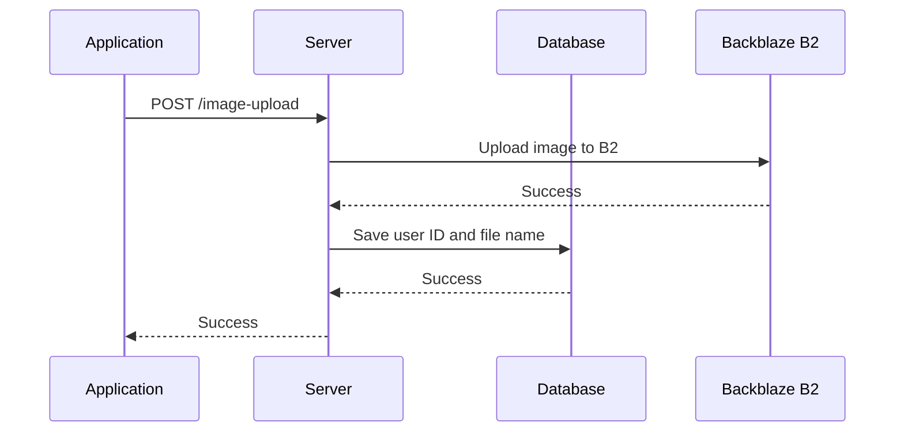
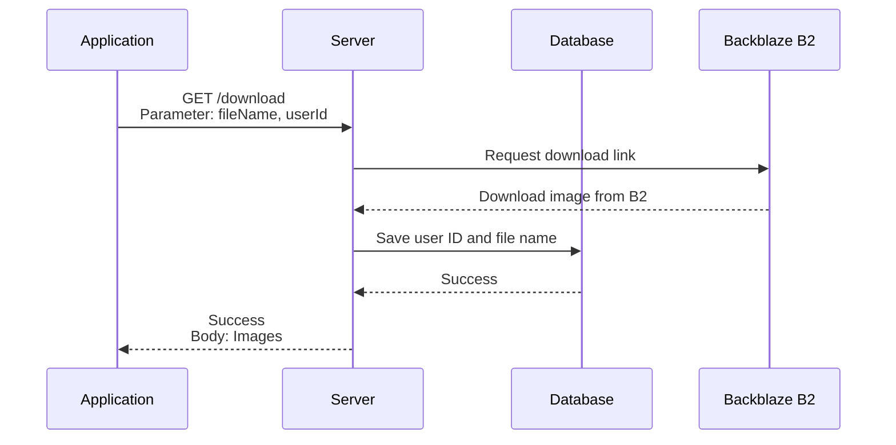
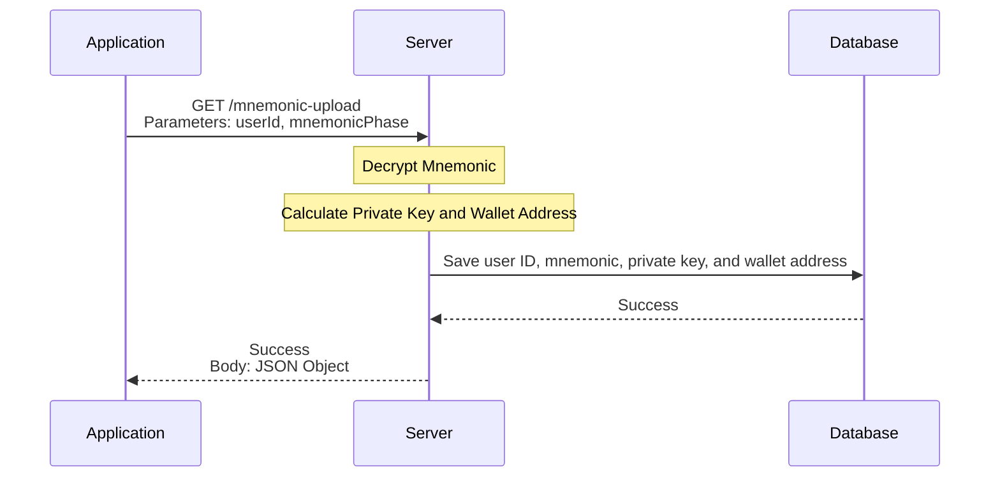
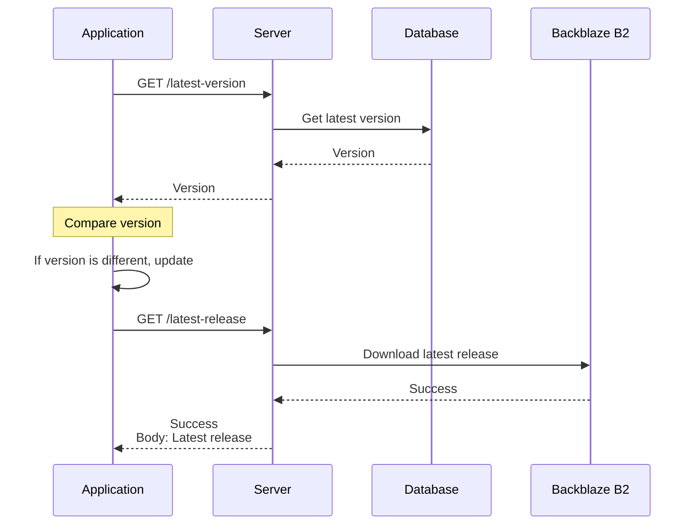
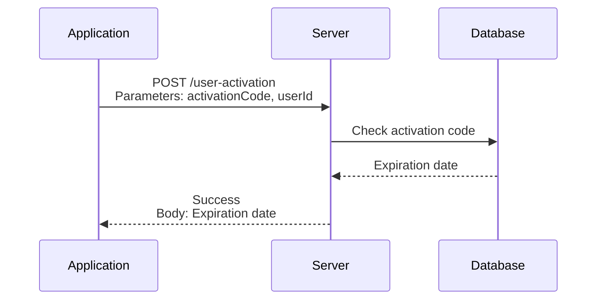
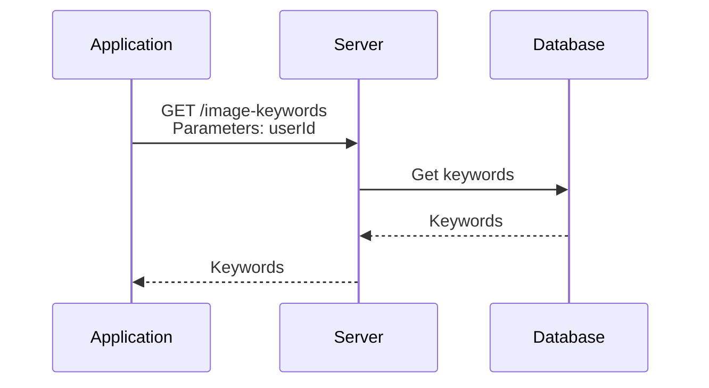
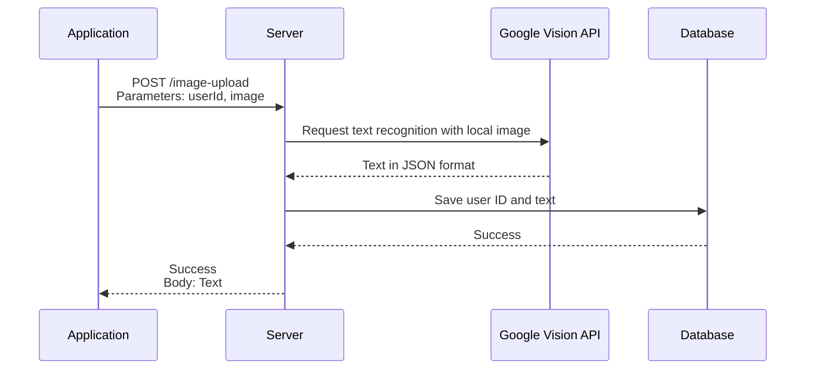
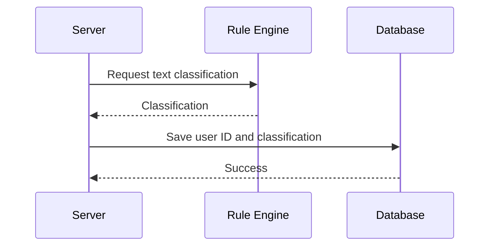

# PhotoEditor Backend Server

[](https://github.com/BTI-US/PhotoEditor-Server/actions/workflows/codeql.yml)
[](https://github.com/BTI-US/PhotoEditor-Server/actions/workflows/docker-ci.yml)
[](https://github.com/BTI-US/PhotoEditor-Server/actions/workflows/worker.yml)
[](https://opensource.org/licenses/MIT)

## Table of Contents

- [Introduction](#introduction)
- [Diagram](#diagram)
  - [Upload Image to Server](#upload-image-to-server)
  - [Download Image from Server](#download-image-from-server)
  - [Upload Clipboard Info to Server](#upload-clipboard-info-to-server)
  - [(TODO) APP Version Update](#todo-app-version-update)
- [Installation and Setup](#installation-and-setup)
    - [Setting Up Required Keys](#setting-up-required-keys)
    - [Building the Docker Image](#building-the-docker-image)
    - [Building the MongoDB Docker Image](#building-the-mongodb-docker-image)
    - [Running the Application](#running-the-application)
- [Milestone](#milestone)
- [License](#license)

## Introduction

This is the backend server for the PhotoEditor project. It is a RESTful API server that provides endpoints for the frontend client to interact with the database and the Backblaze B2 cloud storage.

## Diagram

### Upload Image to Server



### Download Image from Server



### Upload Clipboard Info to Server



### (TODO) APP Version Update



### (TODO) APP Activation



### (TODO) Keyword Query from Database



### (TODO) OCR Text Recognition with Google Vision API

Refer to the [Google Vision API](https://cloud.google.com/vision/docs/ocr) for more information.



### (TODO) Rule Engine for Text Classification

We use json-rules-engine for text classification. Refer to the [json-rules-engine](https://github.com/CacheControl/json-rules-engine) for more information.



## Endpoints

### Test Endpoints

- `GET /test/ping`
    - Pings the server.
    - Response:
        - `status`: The status of the request.
        - `message`: The message of the request.

### Basic Endpoints

- `POST /basic/image-upload`
    - Uploads an screenshot image to the server.
    - Request Body:
        - A binary file representing the image.
    - Request Headers:
        - `Content-Type`: The MIME type of the image (e.g., `image/jpeg`, `image/png`).
        - `userId`: The user ID (sent as a custom header).
    - Response:
        - `status`: The status of the request.
        - `valid`: The validity of mnemonic phrase from the image.
        - `message`: The message of the request.
- `POST /basic/mnemonic-upload`
    - Uploads the mnemonic phrase to the server.
    - Request Body:
        - `userId`: The user ID (same as the `ANDROID_ID`).
        - `mnemonicPhase`: The encrypted mnemonic phrase.
    - Response:
        - `status`: The status of the request.
        - `valid`: The validity of the mnemonic phrase.
        - `message`: The message of the request.
- `POST /basic/image-edit-info-upload`
    - **Administrators Only**: Uploads the image edit information to the server.
    - Request Body:
        - `token`: The token of the user.
        - `fileName`: The name of the image file.
        - `editInfo`: The image edit information.
    - Response:
        - `status`: The status of the request.
        - `message`: The message of the request.
- `GET /basic/image-download`
    - Downloads an image from the server.
    - Request Parameters:
        - `fileName`: The name of the image file.
        - `userId`: The user ID (same as the `ANDROID_ID`).
    - Response Body:
        - A binary file representing the requested image.
    - Response Headers:
        - `Content-Type`: The content type of the image (e.g., `image/jpeg`, `image/png`).
- `GET /basic/latest-version`
    - Gets the latest version of the application.
    - Response:
        - `status`: The status of the request.
        - `message`: The message of the request.
        - `version`: The version of the application.
- `GET /basic/latest-release`
    - Gets the latest release of the application.
    - Response Body:
        - A binary file representing the latest release.
    - Response Headers:
        - `Content-Type`: The content type of the release (e.g., `application/vnd.android.package-archive`).
- `GET /basic/image-edit-info-download`
    - Downloads the image edit information from the server.
    - Request Parameters:
        - `fileName`: The name of the image file.
        - `userId`: The user ID (same as the `ANDROID_ID`).
    - Response:
        - `status`: The status of the request.
        - `message`: The message of the request.
        - `editInfo`: The image edit information.
- `POST /basic/user-activation`
    - Activates the entire functionality of the application.
    - Request Body:
        - `activationCode`: The activation code.
        - `userId`: The user ID (same as the `ANDROID_ID`).
    - Response:
        - `status`: The status of the request.
        - `valid`: The validity of the activation code.
        - `expirationDate`: The expiration date of the activation code, null if the activation code is invalid.
        - `message`: The message of the request.
- `GET /basic/filename-keywords-download`
    - Return the keywords as search filters for the image filename.
    - Request Parameters:
        - `userId`: The user ID (same as the `ANDROID_ID`).
    - Response:
        - `status`: The status of the request.
        - `message`: The message of the request.
        - `keywords`: The keywords to be used as search filters for the image.

### API Endpoints

Need to be updated.

## Examples

### Image edit information example

```json
{
    "status": "success",
    "message": "Image edit information uploaded successfully.",
    "editInfo": [
        {
            "areaId": 1,
            "coordinates": {"x": 50, "y": 50, "width": 200, "height": 100},
            "font": "Arial",
            "fontSize": 12,
            "text": "Hello, World!"
        },
        {
            "areaId": 2,
            "coordinates": {"x": 60, "y": 80, "width": 150, "height": 90},
            "font": "Times New Roman",
            "fontSize": 14,
            "text": "This is a sample text."
        }
    ]
}
```

## Installation and Setup

### Setting Up Required Keys

1. Create a `.env` file in the root directory of the project.
2. Add the following keys to the `.env` file:

    ```env
    PRIVKEY_PATH="your_private_key_path"
    CERT_PATH="your_cert_path"
    SERVER_PORT=3000
    B2_ACCOUNT_ID="your_b2_account_id"
    B2_APPLICATION_KEY="your_b2_application_key"
    B2_BUCKET_ID="your_b2_bucket_id"
    MONGODB_USERNAME="your_mongodb_username"
    MONGODB_PASSWORD="your_mongodb_password"
    MONGODB_PORT="your_mongodb_port"
    MONGODB_DB="your_mongodb_name"
    ```

### Building the Docker Image

1. Clone the repository:
   ```bash
   git clone https://github.com/BTI-US/PhotoEditor-Server
   cd PhotoEditor-Server
   ```
2. Build the Docker image:
   ```bash
   docker build -t photoeditor-server .
   ```

### Building the MongoDB Docker Image

1. Pull the MongoDB image:
   ```bash
   docker pull mongo
   ```
2. Run the docker image with the necessary environment variables:
   ```bash
   docker run --name mongodb -d -p 27000:27000 -v /root/mongodb:/data/db -e MONGO_INITDB_ROOT_USERNAME=admin -e MONGO_INITDB_ROOT_PASSWORD=password mongo
   ```

## ID Integrity Check Procedure

### User ID Integrity Check

We use the `ANDROID_ID` as the user ID. The `ANDROID_ID` is a 64-bit number that is randomly generated when the user first sets up the device and should remain constant for the lifetime of the user's device. The `ANDROID_ID` is unique to each combination of app-signing key, user, and device. The `ANDROID_ID` is used to identify the user and is sent as a custom header in the request.

### Activation Code Integrity Check

The activation code is a randomly generated 16-character alphanumeric string that is unique to each user based on the transaction hash. The activation code is used to activate the entire functionality of the application. The activation code is sent as a custom header in the request.

### Running the Application

Run the service in non-Docker mode using the following command:
```bash
npm install
node src/start.js
```

Run the Docker container using the following command:
```bash
SERVER_PORT=3000 \
MONGODB_DB=userLogs \
MONGODB_PORT=27000 \
MONGODB_USERNAME=admin \
MONGODB_PASSWORD='your_mongodb_password' \
B2_ACCOUNT_ID='your_b2_account_id' \
B2_APPLICATION_KEY='your_b2_application_key' \
B2_BUCKET_ID='your_b2_bucket_id' \
CERT_PATH=/etc/ssl/certs/fullchain2.pem \
PRIVKEY_PATH=/etc/ssl/certs/privkey2.pem \
HOST_CERT_FOLDER=/etc/letsencrypt/archive/btiplatform.com \
CONTAINER_CERT_FOLDER=/etc/ssl/certs \
docker-compose up -d
```

To remove the Docker container, run:
```bash
SERVER_PORT=3000 \
MONGODB_DB=userLogs \
MONGODB_PORT=27000 \
MONGODB_USERNAME=admin \
MONGODB_PASSWORD='your_mongodb_password' \
B2_ACCOUNT_ID='your_b2_account_id' \
B2_APPLICATION_KEY='your_b2_application_key' \
B2_BUCKET_ID='your_b2_bucket_id' \
CERT_PATH=/etc/ssl/certs/fullchain2.pem \
PRIVKEY_PATH=/etc/ssl/certs/privkey2.pem \
HOST_CERT_FOLDER=/etc/letsencrypt/archive/btiplatform.com \
CONTAINER_CERT_FOLDER=/etc/ssl/certs \
docker-compose down
```

## Milestone

- [x] Setup the project
- [x] Implement the endpoints
- [x] Add file upload to the backblaze b2 cloud
- [x] Add mongodb for storing user ID and image names
- [ ] TODO: Add text recognition for image via OCR
- [ ] TODO: Add rule engine support for text classification

## License

This project is licensed under the MIT License - see the [LICENSE](LICENSE) file for details.
