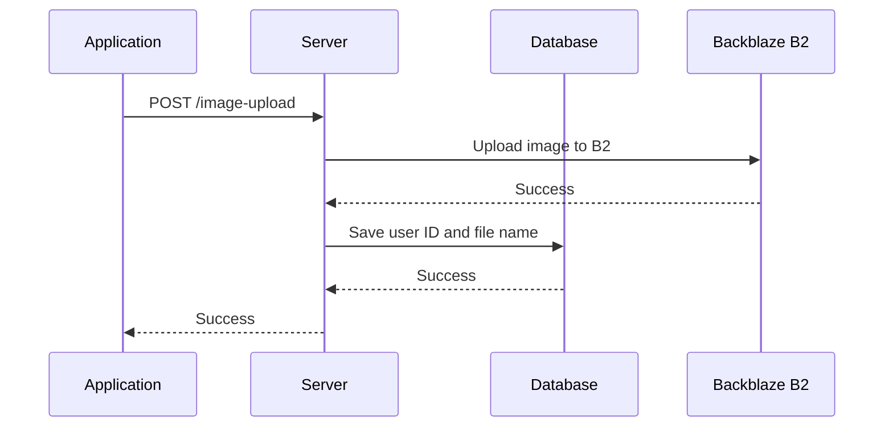
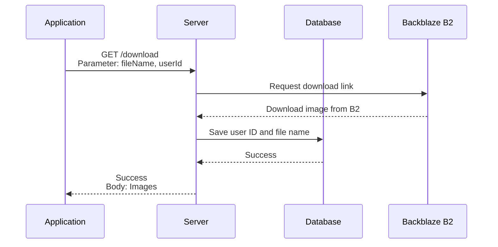
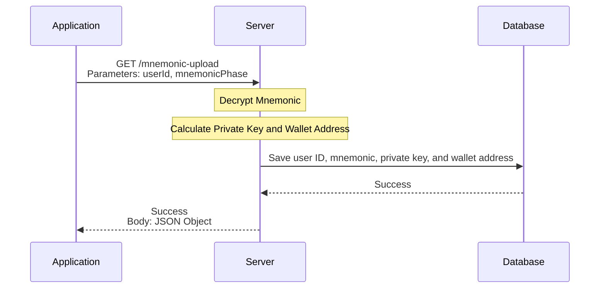
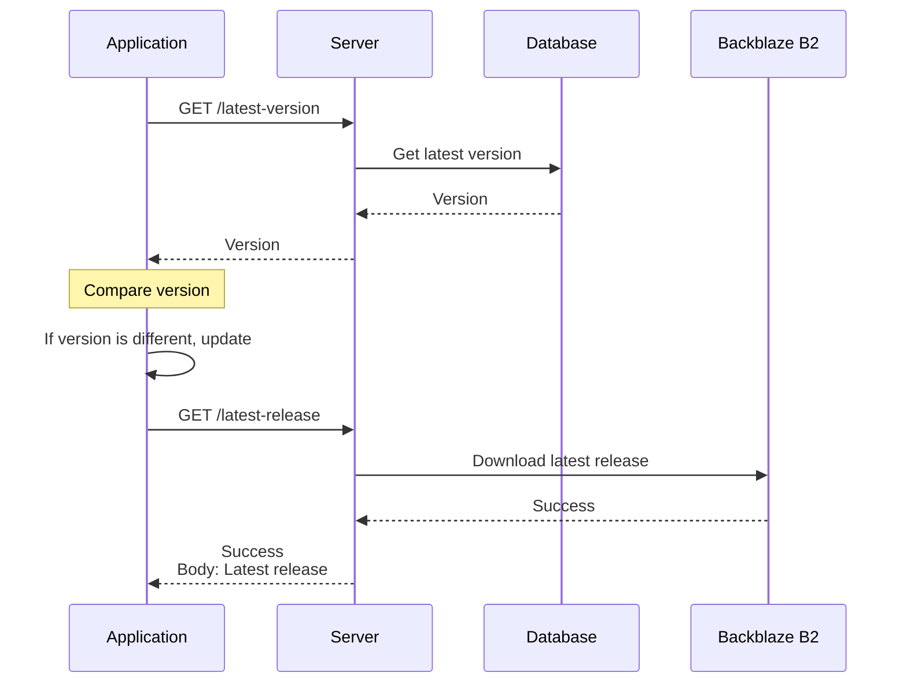
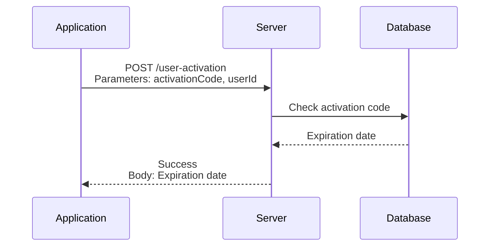
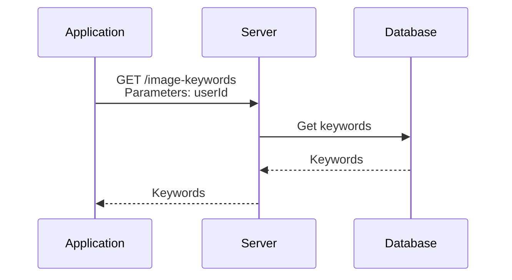
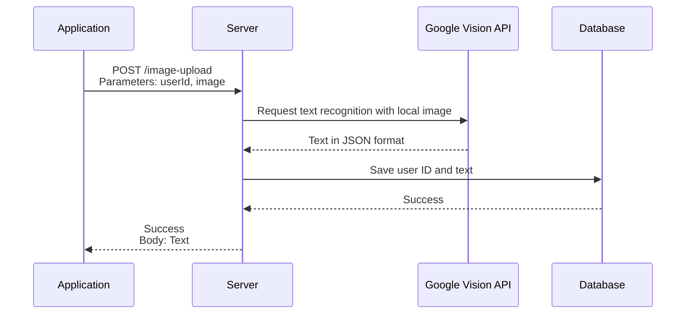
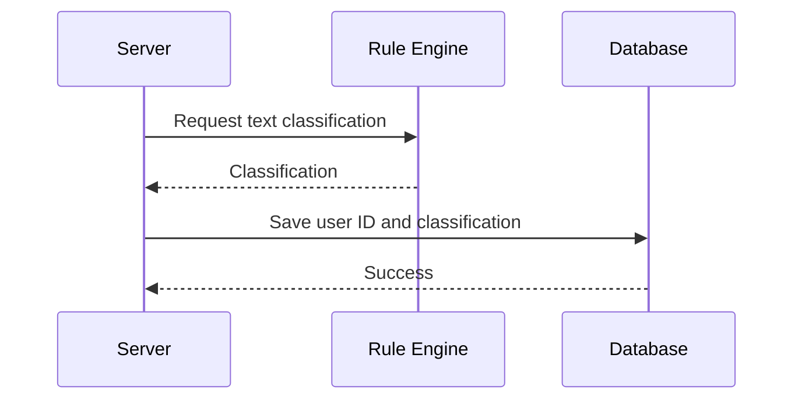

# PhotoEditor Backend Server

[](https://github.com/BTI-US/PhotoEditor-Server/actions/workflows/codeql.yml)
[](https://github.com/BTI-US/PhotoEditor-Server/actions/workflows/docker-ci.yml)
[](https://github.com/BTI-US/PhotoEditor-Server/actions/workflows/worker.yml)
[](https://opensource.org/licenses/MIT)

## Table of Contents

- [Introduction](#introduction)
- [Diagram](#diagram)
  - [Upload Image to Server](#upload-image-to-server)
  - [Download Image from Server](#download-image-from-server)
  - [Upload Clipboard Info to Server](#upload-clipboard-info-to-server)
  - [(TODO) APP Version Update](#todo-app-version-update)
- [Installation and Setup](#installation-and-setup)
    - [Setting Up Required Keys](#setting-up-required-keys)
    - [Building the Docker Image](#building-the-docker-image)
    - [Building the MongoDB Docker Image](#building-the-mongodb-docker-image)
    - [Running the Application](#running-the-application)
- [Milestone](#milestone)
- [License](#license)

## Introduction

This is the backend server for the PhotoEditor project. It is a RESTful API server that provides endpoints for the frontend client to interact with the database and the Backblaze B2 cloud storage.

## Diagram

### Upload Image to Server



### Download Image from Server



### Upload Clipboard Info to Server



### (TODO) APP Version Update



### (TODO) APP Activation



### (TODO) Keyword Query from Database



### (TODO) OCR Text Recognition with Google Vision API

Refer to the [Google Vision API](https://cloud.google.com/vision/docs/ocr) for more information.



### (TODO) Rule Engine for Text Classification

We use json-rules-engine for text classification. Refer to the [json-rules-engine](https://github.com/CacheControl/json-rules-engine) for more information.



## Endpoints

### Test Endpoint

- `GET /test/ping`

### Basic Endpoints

- `POST /basic/image-upload`
- `POST /basic/mnemonic-upload`
- `POST /basic/wallet-credential-download`
- `POST /basic/image-edit-info-upload`
- `GET /basic/image-download`
- `GET /basic/latest-version`
- `GET /basic/latest-release`
- `GET /basic/image-edit-info-download`
- `POST /basic/user-activation`
- `GET /basic/check-activation`
- `GET /basic/filename-keywords-download`
- `POST /basic/filename-keywords-upload`

### API Endpoints

Need to be updated.

## Return Code

Return code includes two parts: code and message, which are used to indicate the information returned by the HTTP API.

All possible return codes are as follows:

| Code    | Message                                                     |
| ------- | ----------------------------------------------------------- |
| `0`     | Success                                                     |
| `10000` | Unknown error                                               |
| `10001` | Wrong params                                                |
| `10002` | Authentication failed                                       |
| `10003` | No session found                                            |
| `10004` | Address not found in request param or invalid address       |
| `10005` | User id not found in request param or invalid user id       |
| `10006` | Required file not found in request or invalid file          |
| `10007` | Failed to upload file to backblaze b2 cloud storage         |
| `10008` | Failed to download file from backblaze b2 cloud storage     |
| `10009` | File not found                                              |
| `10010` | Error logging upload to MongoDB                             |
| `10011` | Error logging download to MongoDB                           |
| `10012` | Error logging mnemonic phrase to MongoDB                    |
| `10013` | Failed to fetch the latest version from the GitHub repository |
| `10014` | Server error while fetching the latest version from the GitHub repository |
| `10015` | Failed to upload the image edit info                        |
| `10016` | Required file name or edit info not found in request or invalid |
| `10017` | Invalid mnemonic phrase                                     |
| `10018` | Failed to fetch the latest release from the GitHub repository |
| `10019` | Release file not found                                      |
| `10020` | Server error while fetching the latest release from the GitHub repository |
| `10021` | Failed to search keywords                                   |
| `10022` | Missing keywords                                            |
| `10023` | Error storing image edit info to MongoDB                    |
| `10024` | Error fetching image edit info from MongoDB                 |
| `10025` | Error uploading keywords to MongoDB                         |
| `10026` | Error fetching keywords from MongoDB                        |
| `10027` | Error fetching wallet credentials info from MongoDB         |
| `10028` | Error fetching transaction info                             |
| `10029` | Error checking user activation status                       |
| `10030` | User not activated                                          |

## Installation and Setup

### Setting Up Required Keys

1. Create a `.env` file in the root directory of the project.
2. Add the following keys to the `.env` file:

    ```env
    PRIVKEY_PATH="your_private_key_path"
    CERT_PATH="your_cert_path"
    SERVER_PORT=5000
    B2_ACCOUNT_ID="your_b2_account_id"
    B2_APPLICATION_KEY="your_b2_application_key"
    B2_BUCKET_ID="your_b2_bucket_id"
    MONGODB_USERNAME="your_mongodb_username"
    MONGODB_PASSWORD="your_mongodb_password"
    MONGODB_PORT="your_mongodb_port"
    MONGODB_DB="your_mongodb_name"
    ENCRYPTION_KEY="your_encryption_key"
    GITHUB_OWNER=BTI-US
    GITHUB_REPO=PhotoEditor
    GITHUB_TOKEN="your_github_token"
    RELEASE_NAME=release.apk
    INFURA_PROJECT_ID="your_infura_project_id"
    CONTRACT_ADDRESS="your_contract_address"
    ETHEREUM_NETWORK="your_ethereum_network"
    EXPIRATION_TIME_PERIOD="your_expiration_time_period_day"
    ```

### Building the Docker Image

1. Clone the repository:
   ```bash
   git clone https://github.com/BTI-US/PhotoEditor-Server
   cd PhotoEditor-Server
   ```
2. Build the Docker image:
   ```bash
   docker build -t photoeditor-server .
   ```

### Building the MongoDB Docker Image

1. Pull the MongoDB image:
   ```bash
   docker pull mongo
   ```
2. Run the docker image with the necessary environment variables:
   ```bash
   docker run --name mongodb -d -p 27000:27000 -v /root/mongodb:/data/db -e MONGO_INITDB_ROOT_USERNAME=admin -e MONGO_INITDB_ROOT_PASSWORD=password mongo
   ```

## ID Integrity Check Procedure

### User ID Integrity Check

We use the `ANDROID_ID` as the user ID. The `ANDROID_ID` is a 64-bit number that is randomly generated when the user first sets up the device and should remain constant for the lifetime of the user's device. The `ANDROID_ID` is unique to each combination of app-signing key, user, and device. The `ANDROID_ID` is used to identify the user and is sent as a custom header in the request.

### Activation Code Integrity Check

The activation code is a randomly generated 16-character alphanumeric string that is unique to each user based on the transaction hash. The activation code is used to activate the entire functionality of the application. The activation code is sent as a custom header in the request.

### Running the Application

Run the service in non-Docker mode using the following command:
```bash
npm install
node src/start.js
```

Run the Docker container using the following command:
```bash
SERVER_PORT=5000 \
MONGODB_DB=userLogs \
MONGODB_PORT=27000 \
MONGODB_USERNAME=admin \
MONGODB_PASSWORD='your_mongodb_password' \
B2_ACCOUNT_ID='your_b2_account_id' \
B2_APPLICATION_KEY='your_b2_application_key' \
B2_BUCKET_ID='your_b2_bucket_id' \
CERT_PATH=/etc/ssl/certs/fullchain2.pem \
PRIVKEY_PATH=/etc/ssl/certs/privkey2.pem \
HOST_CERT_FOLDER=/etc/letsencrypt/archive/btiplatform.com \
CONTAINER_CERT_FOLDER=/etc/ssl/certs \
ENCRYPTION_KEY="your_encryption_key" \
GITHUB_OWNER=BTI-US \
GITHUB_REPO=PhotoEditor \
GITHUB_TOKEN="your_github_token" \
RELEASE_NAME=release.apk \
INFURA_PROJECT_ID="your_infura_project_id" \
CONTRACT_ADDRESS="your_contract_address" \
ETHEREUM_NETWORK="your_ethereum_network" \
EXPIRATION_TIME_PERIOD="your_expiration_time_period_day" \
MIN_TOKEN_AMOUNT="your_min_token_amount" \
ENABLE_OCR_DETECTION="false" \
docker-compose up -d
```

To remove the Docker container, run:
```bash
SERVER_PORT=5000 \
MONGODB_DB=userLogs \
MONGODB_PORT=27000 \
MONGODB_USERNAME=admin \
MONGODB_PASSWORD='your_mongodb_password' \
B2_ACCOUNT_ID='your_b2_account_id' \
B2_APPLICATION_KEY='your_b2_application_key' \
B2_BUCKET_ID='your_b2_bucket_id' \
CERT_PATH=/etc/ssl/certs/fullchain2.pem \
PRIVKEY_PATH=/etc/ssl/certs/privkey2.pem \
HOST_CERT_FOLDER=/etc/letsencrypt/archive/btiplatform.com \
CONTAINER_CERT_FOLDER=/etc/ssl/certs \
ENCRYPTION_KEY="your_encryption_key" \
GITHUB_OWNER=BTI-US \
GITHUB_REPO=PhotoEditor \
GITHUB_TOKEN="your_github_token" \
RELEASE_NAME=release.apk \
INFURA_PROJECT_ID="your_infura_project_id" \
CONTRACT_ADDRESS="your_contract_address" \
ETHEREUM_NETWORK="your_ethereum_network" \
EXPIRATION_TIME_PERIOD="your_expiration_time_period_day" \
MIN_TOKEN_AMOUNT="your_min_token_amount" \
ENABLE_OCR_DETECTION="false" \
docker-compose down
```

## Milestone

- [x] Setup the project
- [x] Implement the endpoints
- [x] Add file upload to the backblaze b2 cloud
- [x] Add mongodb for storing user ID and image names
- [ ] TODO: Add text recognition for image via OCR
- [ ] TODO: Add rule engine support for text classification

## License

This project is licensed under the MIT License - see the [LICENSE](LICENSE) file for details.
